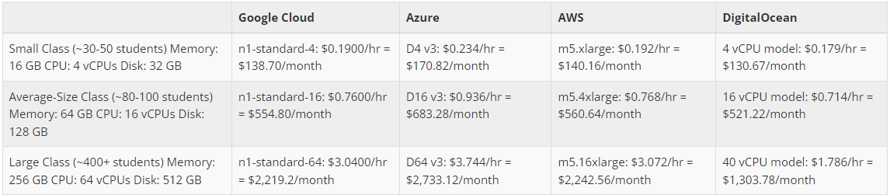
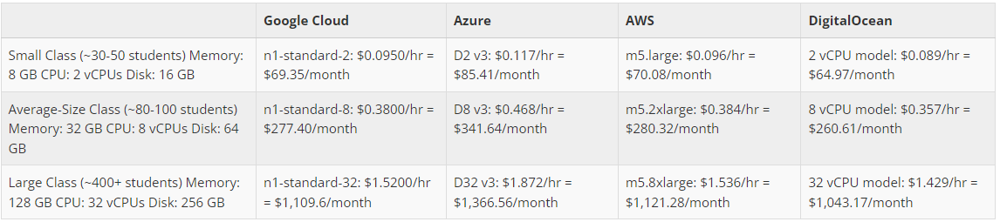
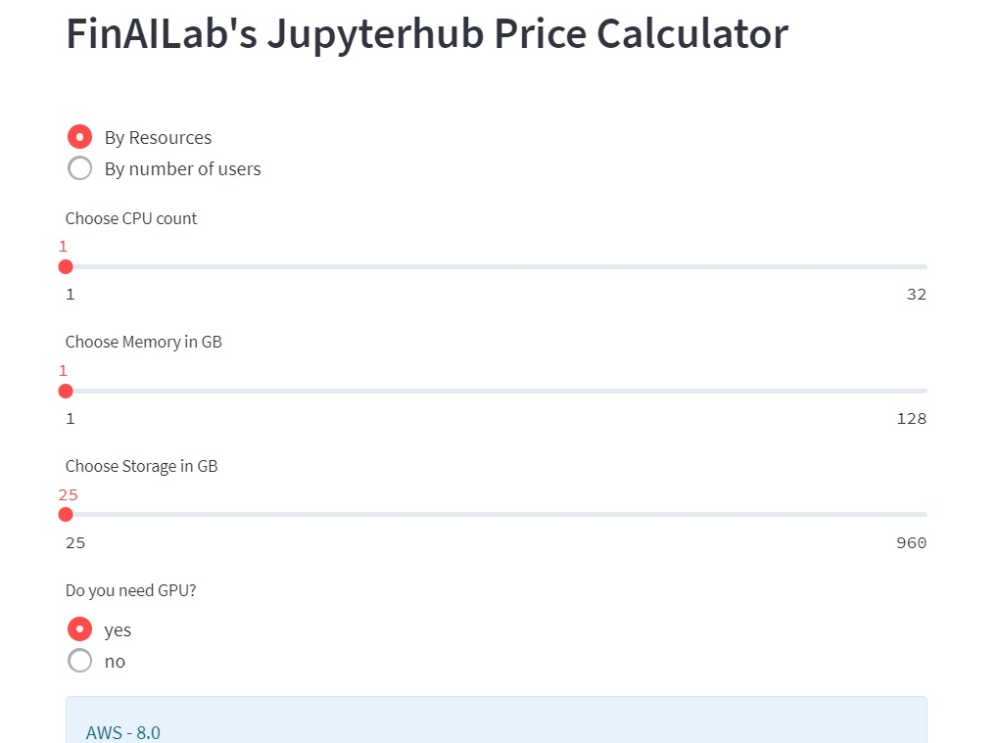
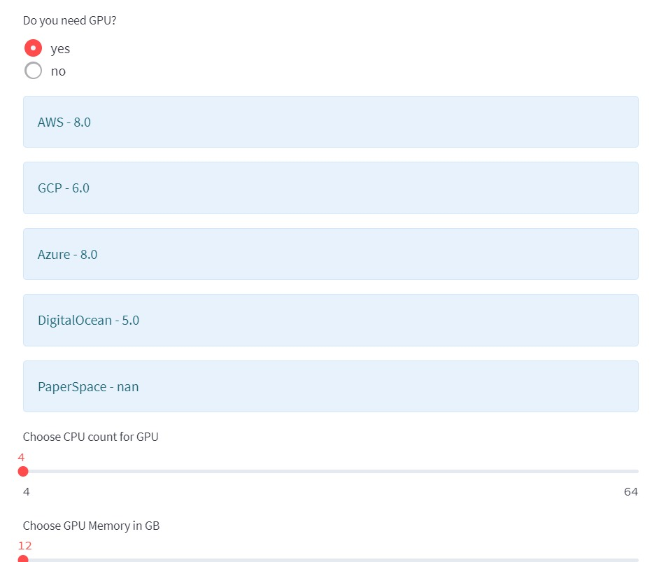
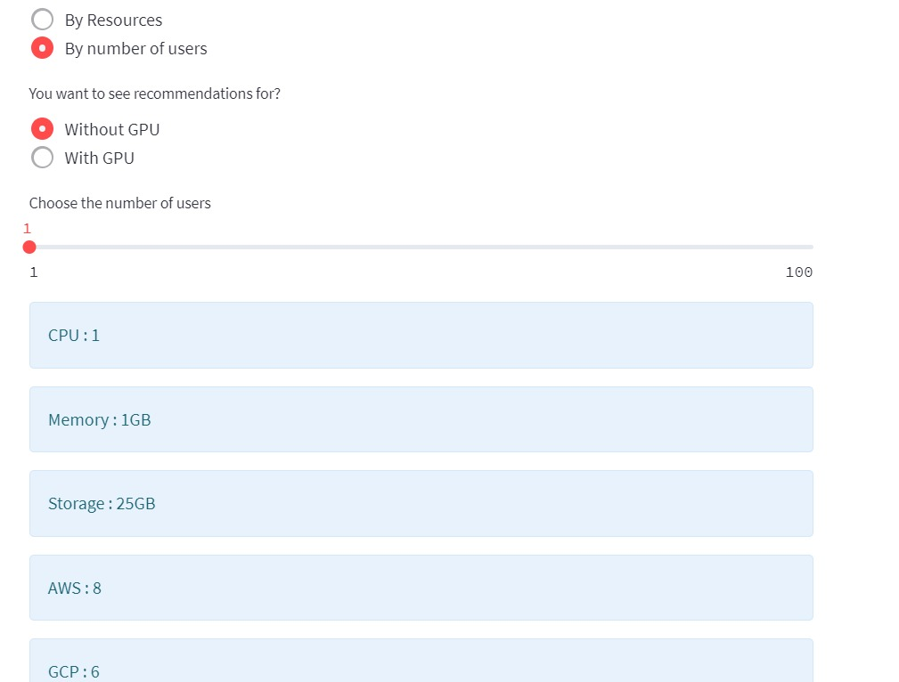
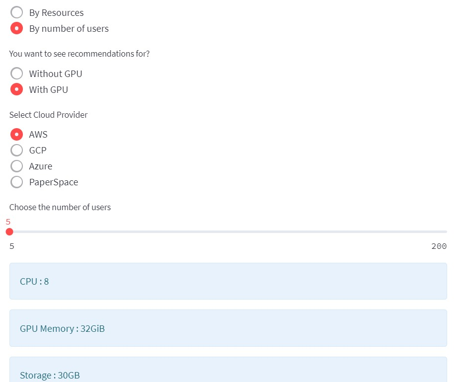

.. _Choose Infra:

Choosing the righ infrastructure is done in 2 steps:

- Choose the right hub type
- Choose the right cloud service

======================================
Choose the right hub type
======================================

- Cost calculators

.. image:: HubCost.PNG
  :width: 800
  :alt: Alternative text

- Cost of littlest Jupyter hub (tljh)

In order to describe the costs of each option accurately, there are three dimensions of the set-up that must be considered: the allotment of memory/RAM, CPU usage, and disk space that each user would need. In that way, varying class sizes and needs differentiate the amount of resources given to each cost dimension. Four major options are outlined in the following chart to determine the allocation of resources across those three types: small classes (~30-50 students), average-sized classes (~80-100 students), and large classes (~100-400+). The following formulas for each of these three dimensions are widely applicable across different scenarios for The Littlest JupyterHub (TLJH):

1. Recommended Memory = (Maximum Concurrent Users x Maximum Memory per User) + 128 MB
2. Recommended vCPUs = (Maximum Concurrent Users x Maximum CPU Usage per User) + 20%
3. Recommended Disk Size = (Total Users x Maximum Disk Usage per User) + 2 GB

- Maximum amount of concurrent users should be approximately 40-60% of the total users at any given point
- 1 GB typically serves as maximum memory per user, with 128 MB being overhead for TLJH and related services
- Based on class sizes: 16 GB for 30 students, 64 GB for 100 students, and 256 GB for over 400 students
- Most memory, vCPU, and disk installations come hand-in-hand, so memory calculation can be used to determine rest of setup ⇒ 4 vCPUS and 32 GB disk space for small classes, 16 vCPUS and 128 GB disk space for average-sized classes, and 64 vCPUS and 512 GB disk space for large classes

- Cost of Kubernetes based cloud

In order to describe the costs of each option accurately, there are three dimensions of the set-up that must be considered: the allotment of memory/RAM, CPU usage, and disk space that each user would need. In that way, varying class sizes and needs differentiate the amount of resources given to each cost dimension. Three major options are outlined in the following chart to determine the allocation of resources across those three types: small classes (~30-50 students), average-sized classes (~80-100 students), and large classes (~100+). Autoscaling is a key feature of Kubernetes that is the primary cost saver here - a Kubernetes cluster scales down at night and during weekends, scaling up on demand.

The calculations here are based on Berkeley’s JupyterHub cost estimates, which can be viewed here: https://github.com/data-8/jupyterhub-k8s/blob/master/docs/cost-estimation/gce_budgeting.ipynb(link is external)

The following formulas for each of these three dimensions are widely applicable across different scenarios for JupyterHub for Kubernetes:

1. Number of Active Pods = Total Users / 4

2. Recommended Memory = 1 GB x Number of Active Pods

- Number of active pods used by classes, on average, fall somewhere between 1/3rd and 1/6th of total users ⇒ dividing by 4 produces a good estimate for this number

- Memory allocated to each pod is 1 GB, multiply by number of active pods to get  overall memory allocation

- Based on class sizes: 8 GB for 30 students, 32 GB for 100 students, and 128 GB for over 400 students

- Since most memory, vCPU, and disk installations come hand-in-hand, memory calculation can be used to determine rest of setup ⇒ 2 vCPUS and 16 GB disk space for small classes, 8 vCPUS and 64 GB disk space for average-sized classes, and 32 vCPUS and 256 GB disk space for large classes

======================================
Choose the right cloud service type
======================================

Use FinAILab's cloud cost calculator here:

========================================================================================
You can check the price of RESOURCES by selecting CPU count, Memory in GB, Storage here:
========================================================================================

=====================================================================
You can check the price of RESOURCES by selecting GPU if you need it.
=====================================================================

================================================================
You can check the price of hub by selecting the number of users.
================================================================

========================================================================
You can check the price of hub by selecting the number of users with GPU.
========================================================================

======================================
FAQs
======================================

- Should I deploy on my hardware or in the cloud?

- Deploying a JupyterHub in the cloud typically works out to be easier, especially if you don’t have much access to technical resources. Having to handle infrastructure reliably takes time and effort, so we recommend the cloud as a scalable and simpler solution.

- Is there a particular cloud provider that you recommend?

- See the deployment path overview section above. We recommend different cloud providers for different scenarios, although we would recommend using a cloud provider that you have more knowledge/experience with if there is one.

- In general, which option would you recommend for different class sizes, The Littlest JupyterHub or JupyterHub on Kubernetes?

- For courses of 100 or less students, we recommend The Littlest JupyterHub, and for classes with sizes greater than 100, we recommend JupyterHub on Kubernetes.

- What type of hardware should I use?

- Our recommendation varies based on the size of the class as well as your own preferences - fewer machines with a lot of RAM, machines with fast CPUs instead, etc. Overall, we have seen that RAM tends to be the largest consideration in our calculations, so we would generally recommend going with the first option.

- What are the estimated costs of launching these JupyterHubs?

- See our cost estimation tables for both The Littlest JupyterHub and JupyterHub on Kubernetes above.

- What are some major technical considerations to keep in mind when using these solutions?

- Using our own experiences with these technologies, we have come up with a few major challenges, solutions, and an ideal workflow for administrators.

Challenges:

- Environment standardization is difficult. As a result, we don’t recommend having students set up their own environment, especially for an introductory class.

- Don’t become dependent on any one cloud provider. Since there are a lot of choices for cloud services,  we believe that it is not  - prudent to be reliant on any particular one of them.

- Use platform-agnostic tools. This allows the course infrastructure to be useful for a variety of topics.

- Use open-source tools. Otherwise, you may get stuck with the problem of having proprietary software that is not easily generalizable.

- Having team members with development and operations skills are not quite as common in academia. They will be necessary in order to help scale the technical solutions listed below.

Solutions:

- Harness the cloud’s power. This allows course material to be available to all students regardless of whatever hardware they choose to use.

- Abstract away complex APIs and technologies. There are a plethora of different packages and APIs, with each of them having complex underpinnings, and so we try to focus on only the fundamentals of the underlying analysis and set students up for more advanced courses later on.

- Use diverse and compelling real-world datasets. These will keep students interested in the course material as they know that what they’re doing is “real” data science.

- Anticipate bursts of activity. Students generally do their work during very specific times, such as during class or right before the homework is due. Ensure that your cloud infrastructure is dynamic enough to support that.

- Be able to meet maximum demand. If the cloud goes down during a test or right before an assignment is due, it could cause massive logistical problems.

- Do all of the above with a small team. The model we present would not be able to scale if it necessitated a large team. We generally have structured our courses such that tech-savvy undergraduates would be able to handle back-end operations.

- Using nbgitpuller:

nbgitpuller is a core functionality of JupyterHub and a large advantage over many other proprietary platforms that lets instructors distribute content in a Git repository to students by having them click a simple link while ensuring that students never need to directly interact with Git. It is primarily used with a JupyterHub, but can also work on students' local computers.

Workflow:

- Instructor creates some course material to give to students.

- Instructor pushes latest version to GitHub and sends students a link to interact with material.

- Student clicks on link.

- DataHub authenticates user by either having them sign in or checking their computer’s credentials.

- DataHub creates and starts a Jupyter instance for user or pulls up a pre-existing environment from a previous session.

- Student’s persistent storage volume links to their Jupyter instance.

- DataHub clones or pulls content specified by link into student’s instance.

- Student is directed to a live, in-browser notebook instance that contains content specified in link and is able to be immediately interacted with.

How can I customize the JupyterHub environment for my class?

- See this page(link is external) on Zero to Data 8, which is a resource dedicated to helping administrators understand how to get UC Berkeley’s Data 8 course set up and doubles as a resource for helping get JupyterHubs set up for courses in general.

- Where can I find additional help?

- The Jupyter Community Forum(link is external) is a one-stop shop for any Jupyter (Hub) related questions and is the place to ask for help.

RESOURCES
----------------
Cloud Providers

- Google Cloud:

VM instance pricing:https://cloud.google.com/compute/vm-instance-pricing(link is external)

Free tier:https://cloud.google.com/free(link is external)

- Microsoft Azure:

VM instance pricing: https://azure.microsoft.com/en-us/pricing/calculator/(link is external)

Free tier:https://azure.microsoft.com/en-us/free/(link is external)

- Amazon Web Services (AWS):

VM instance pricing:https://aws.amazon.com/ec2/pricing/on-demand/(link is external)

Free tier:https://aws.amazon.com/free/(link is external)

- DigitalOcean:

VM instance pricing:https://www.digitalocean.com/pricing/(link is external)

60-day free trial: https://www.digitalocean.com/community/questions/is-there-a-digitalocean-free-trial-available(link is external)

Pathway Guides

- Azure Notebooks:

Website:https://notebooks.azure.com/(link is external)

Signing Up:https://notebooks.azure.com/help/signing-up(link is external)

Documentation:https://notebooks.azure.com/help/jupyter-notebooks(link is external)

Creating a Project: https://notebooks.azure.com/help/projects(link is external)

- Zero to JupyterHub:

Website:https://zero-to-jupyterhub.readthedocs.io/en/latest/index.html(link is external)

Creating Kubernetes Clusters:https://zero-to-jupyterhub.readthedocs.io/create-k8s-cluster.html(link is external)

Setting up JupyterHub:https://zero-to-jupyterhub.readthedocs.io/en/latest/setup-jupyterhub(link is external)

Customized Deployments:https://zero-to-jupyterhub.readthedocs.io/en/latest/customizing/(link is external)

Administrator Guide:https://zero-to-jupyterhub.readthedocs.io/en/latest/administrator(link is external)

- The Littlest JupyterHub (TLJH):

Website:http://tljh.jupyter.org/en/latest/(link is external)

Use Cases:http://tljh.jupyter.org/en/latest/topic/whentouse.html#topic-whentouse(link is external)

Installation:http://tljh.jupyter.org/en/latest/install/index.html(link is external)

How-To Guides:http://tljh.jupyter.org/en/latest/howto/index.html(link is external)

Topic Guides:http://tljh.jupyter.org/en/latest/topic/index.html
